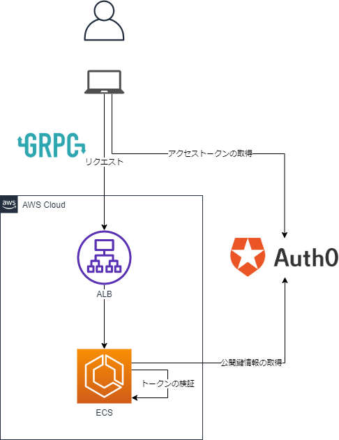

# go-grpc-auth0-aws

## Architecture



## Init

下記パラメータを埋めてください

- `server/server.go`
  - `auth0_url`, `audience`
- `grpcurl-aws.sh`
  - `tenant_domain`, `client_id`, `client_secret`
- `grpcurl-local.sh`
  - `tenant_domain`, `client_id`, `client_secret`

## Deployment

1. サーバー証明書の事前準備

HTTPS通信が必須となっているので、事前にサーバー証明書が必要です。
ドメインはRoute53で登録済みであり、`go-grpc-server`というサブドメインの証明書がACMで発行済であるという前提で進めます。

2. デプロイ

```bash
terraform plan -var "aws_account_id=<your-aws-account-id>" -var "domain=<your-domain>"
terraform apply -var "aws_account_id=<your-aws-account-id>" -var "domain=<your-domain>"
```
